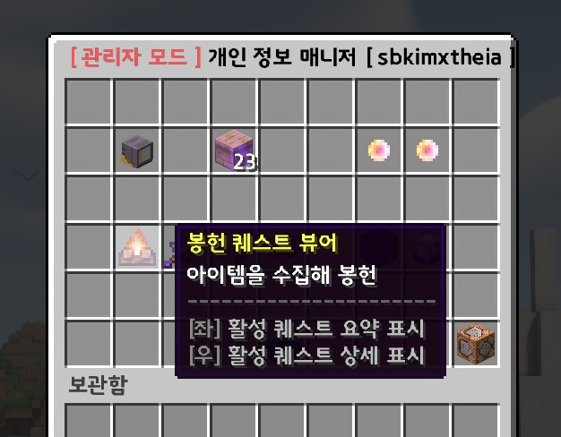
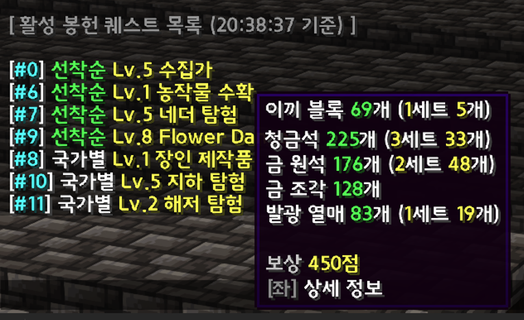
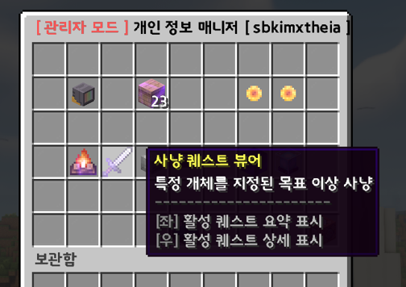
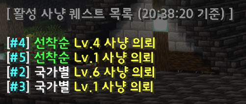
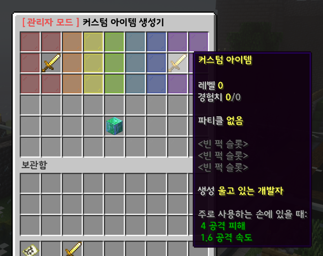
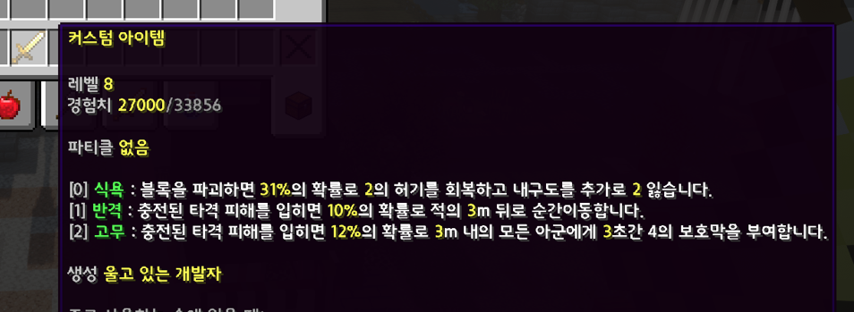
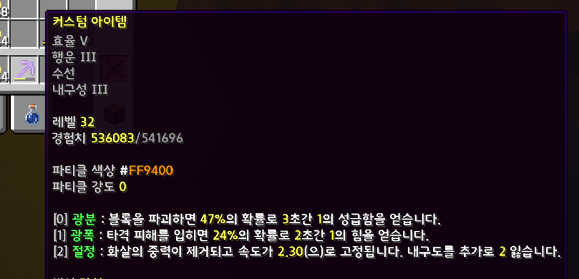
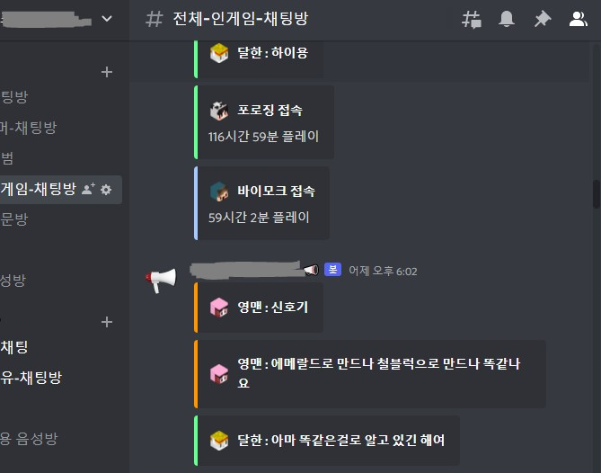

# 마인크래프트 삼국지 서버 프로젝트

스트리머가 정해진 수의 참여자들과 함께 한 국가가 되어,  
국가별 월드에서 성장 및 다양한 컨텐츠를 진행하는 마인크래프트 서버

## 주요 기능

### 퀘스트 기능

아이템이나 몬스터 처치 수를 정해진 수만큼 확보하여 퀘스트 달성

###### 아이템 확보 및 봉헌 퀘스트

  

###### 몬스터 사냥 퀘스트

### 커스텀 아이템 시스템

아끼는 도구를 커스텀하여 다양한 성능 추가 및 효과 부여

### 디스코드 양방향 채팅 연동

디스코드 <-> 마인크래프트 간 채팅, 이벤트 등 연동

