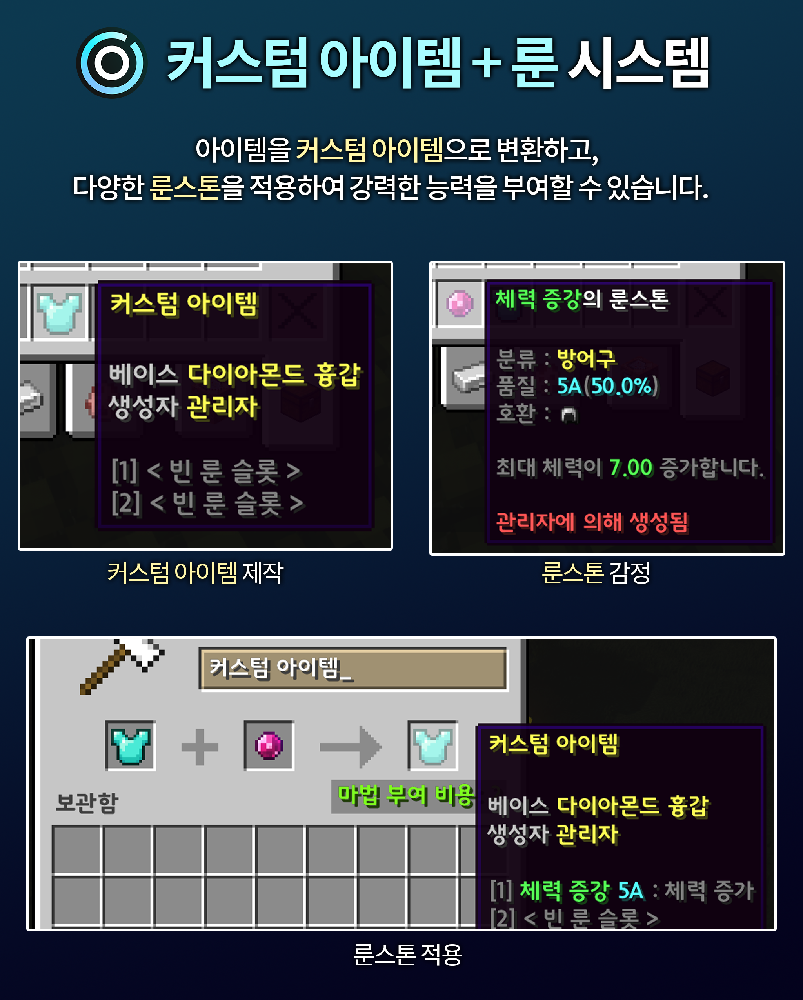
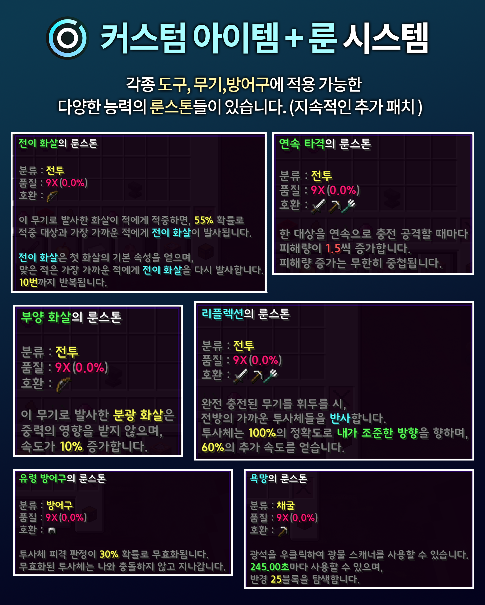

# Pixel Universe 프로젝트

마인크래프트 반야생 서버 프로젝트

-----

## [서버 공식 가이드북](https://app.gitbook.com/o/OEzEN8ffDTM8s9sq8JvC/s/4JZZXdi0Uwk0711M4IXx/readme/readme-1)

서버의 다양한 컨텐츠와 그 사용 방법(명령어 등)에 관한 문서  
[본 웹페이지](https://app.gitbook.com/o/OEzEN8ffDTM8s9sq8JvC/s/4JZZXdi0Uwk0711M4IXx/readme/readme-1) 참고

## 주요 기능 요약

### 1. [커스텀 아이템](https://app.gitbook.com/o/OEzEN8ffDTM8s9sq8JvC/s/4JZZXdi0Uwk0711M4IXx/readme/customitem) 시스템 (메인 시스템)

아이템을 커스텀화 후 다양한 룬 적용 기능

  

### 2. [청크 단위 구매 시스템](https://app.gitbook.com/o/OEzEN8ffDTM8s9sq8JvC/s/4JZZXdi0Uwk0711M4IXx/readme/undefined/estate)

청크 단위로 땅을 구매하여 건축  
편리한 UI를 사용해 주변 청크 조회 및 구매

